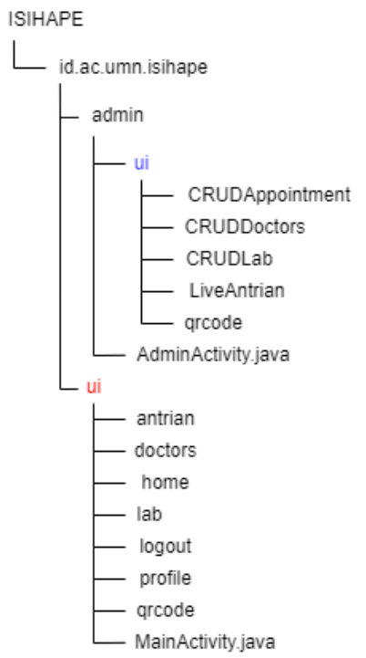
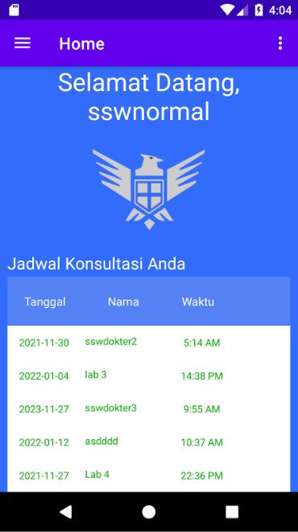
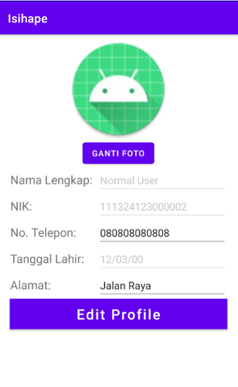
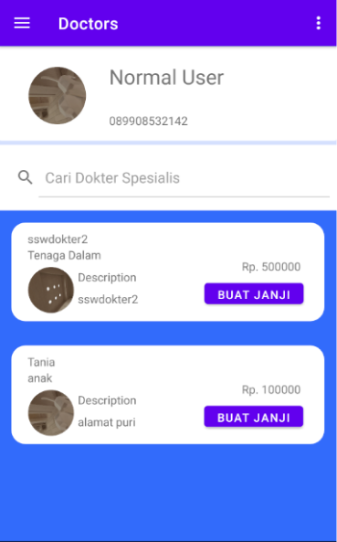
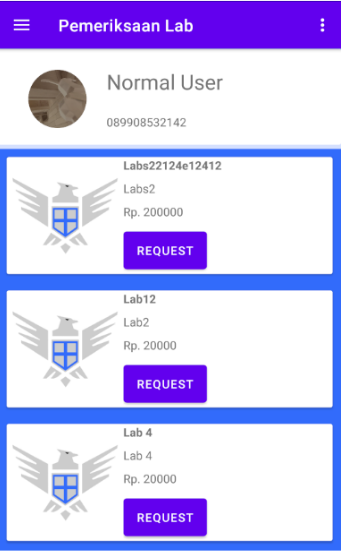

# isihape
An app for Medical Institution such as Hospital to manage their data. Including functionality for Admin, Doctors, Labs, and Patients management.

# File Structure

# Preview

## Normal User

  
 

  
 

  

## Admin

  
  

